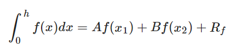
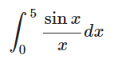
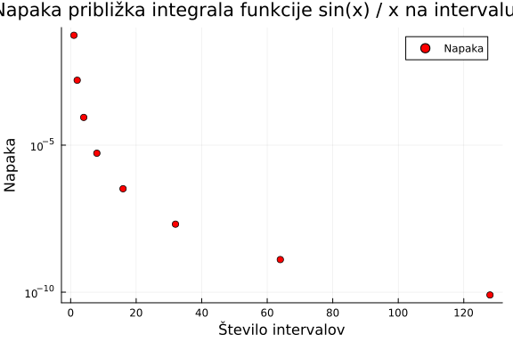

# 2. Domača naloga Gauss-Legendrove kvadrature
Elian Mugerli

Naloga zahteva izpeljavo Gauss-Legendreovega integracijskega pravila na dveh točkah:



vključno s formulo za napako Rf. Napisati je potrebno program, ki to pravilo uporabi za približno računanje integrala. Za konec pa je potrebno še postaviti oceno, koliko izračunov fukncijske vrednosti je potrebnih, za izračun približka za 



na 10 decimalk natančno.

## Rešitev

Potrebno je okoli 120-130 izračunov funkcijske vrednosti za izračun približka podanega integrala na 10 decimalk natančno.

V tem direktoriju se nahajajo datoteke potrebne za delovanje 2. domače naloge. Nalogo poženemo, tako da pokličemo `include("docs/demo.jl")`. V njem se nahaja rešitev za podani problem. Še pred tem je potrebno poklicati `activate Domaca02`.

## Testi

Teste poženemo, tako da pokličemo tako, da v `pkg` načinu poženemo ukaz `test`

```shell
(DomacaXY) pkg> test

    Testing Domaca02
    ...
         Testing Running tests...
Test Summary:             | Pass  Total  Time
Gauss-Legendre kvadrature |    1      1  0.3s
     Testing Domaca02 tests passed 
```

## Dokumentacija

Poročilo generiramo s paketom [Weave.jl](https://github.com/JunoLab/Weave.jl). Podrobnosti so v datoteki `makedocs.jl`.

Zgornja ukaza iz komentarjev in kode v `demo.jl` generirata PDF datoteko, ki se ob generiranju nahaja znotraj direktorija `build` v datoteki `demo.pdf`.